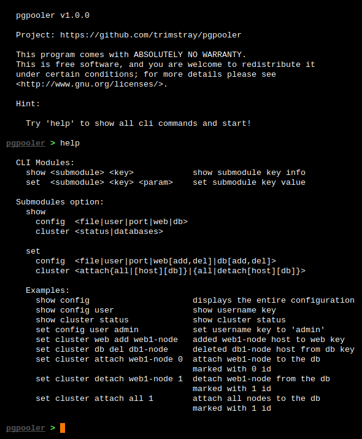

# pgpooler

## Releases

|            **STABLE RELEASE**            |           **TESTING RELEASE**            |
| :--------------------------------------: | :--------------------------------------: |
| []() | []() |
| []() | []() |
| [](https://travis-ci.org/trimstray/pgpooler) | [](https://travis-ci.org/trimstray/pgpooler) |

## Description

**Pgpooler** is a tool that supports **pgpool** management. Provides a cli interface for managing the entire pgpool cluster.

Some functions:

- simple cli interface
- makes using **pcp** commands easier (attach, detach)
- allows you to add web servers and databases on the fly

## Parameters

Provides the following options:

``````
  Usage:
    pgpooler <option|long-option>

  Examples:
    pgpooler --help

  Options:
        --help                      show this message
    -c, --config <file>             attach an external config file to the script
``````

## Screenshot



## Configuration file

The **etc/template.cfg** configuration file (appended with the `-c|--config` parameter) has the following structure:

``````
# shellcheck shell=bash

# Set the username.
_username="postgres"

# Set the pgpool port number.
_port_number="9898"

# Set the web servers stack.
_web_stack=("web1" "web2" "web3")

# Set the database servers stack.
_db_stack=("db1" "db2")
``````

## Pgpooler CLI

### Available commands

```bash
pgpooler > help

  CLI Modules:
    show <submodule> <key>            show submodule key info
    set <submodule> <key> <param>     set submodule key value

  Submodules option:
    show
      config <file|user|port|web|db>
      cluster <status|databases>

    set
      config <file|user|port|web[add,del]|db[add,del]>
      cluster <attach[host][db]|detach[host][db]>

    Examples:
      show config                     displays the entire configuration
      show config user                show username key
      show cluster status             show cluster status
      set config user admin           set username key to 'admin'
      set web add web1-node           added web1-node host to web key
      set db del db1-node             deleted db1-node host from db key
      set cluster attach web1-node 0  attach web1-node to the db
                                      marked with 0 id
      set cluster detach web1-node 1  detach web1-node from the db
                                      marked with 1 id
```

### show

Show configuration:

```bash
pgpooler > show config
{
  Description: Config file
  { "file":"etc/web-stack.cfg" }
}
{
  Description: Username
  { "user":"pg-user" }
}
{
  Description: Pgpool port number
  { "port":"9898" }
}
{
  Description: Web servers
  { "web":"node-web1" }
  { "web":"node-web2" }
  { "web":"node-web3" }
  { "web":"node-web4" }
  { "web":"node-web5" }
  { "web":"node-web6" }
  { "web":"node-web7" }
}
{
  Description: Database servers
  { "db":"node-db1" }
  { "db":"node-db2" }
}
```

Show specific key configuration:

```bash
pgpooler > show config db
{
  Description: Database servers
  { "db":"node-db1" }
  { "db":"node-db2" }
}
```

Show specific node cluster status:

```bash
pgpooler > show cluster status node-web7

    host : node-web7
 backend : node-db1 5432 2 0.500000 up
 backend : node-db2 5432 2 0.500000 up
```

Show database status:

```bash
pgpooler > show cluster databases
ID	 DATABASE
 0	  node-db1 (up)
 1	  node-db2 (up)
```

### set

Add new web node to pgpool cluster config:

```bash
pgpooler > set config web add node-web8
pgpooler > show config web
{
  Description: Web servers
  { "web":"node-web1" }
  { "web":"node-web2" }
  { "web":"node-web3" }
  { "web":"node-web4" }
  { "web":"node-web5" }
  { "web":"node-web6" }
  { "web":"node-web7" }
  { "web":"node-web8" }
}
```

Delete web node from pgpool cluster config:

```bash
pgpooler > set config web del node-web3
pgpooler > show config web
{
  Description: Web servers
  { "web":"node-web1" }
  { "web":"node-web2" }
  { "web":"node-web4" }
  { "web":"node-web5" }
  { "web":"node-web6" }
  { "web":"node-web7" }
  { "web":"node-web8" }
}
```

Detach web node from pgpool cluster:

```bash
pgpooler > set cluster detach node-web7 1
pcp_detach_node -- Command Successful
pgpooler > show cluster status

[...]

    host : node-web7
 backend : node-db1 5432 2 0.500000 up
 backend : node-db2 5432 3 0.500000 down
```

Attach web node to pgpool cluster:

```bash
pgpooler > set cluster attach ticketingweb7 1
pcp_attach_node -- Command Successful
pgpooler > show cluster status

[...]

    host : node-web7
 backend : node-db1 5432 2 0.500000 up
 backend : node-db2 5432 2 0.500000 up
```

## Requirements

**<u>pgpooler</u>** uses external utilities to be installed before running:

- [Pgpool II Wiki](http://pgpool.net/mediawiki/index.php/Main_Page)

## Install/uninstall

It's simple - for install:

``````
./setup.sh install
``````

For remove:

``````
./setup.sh uninstall
``````

> * symlink to `bin/pgpooler` is placed in `/usr/local/bin`
> * man page is placed in `/usr/local/man/man8`

## Use example

Then an example of starting the tool:

``````
pgpooler -c etc/template.cfg
``````

In the first place we define the configuration (which should be prepared in advance):

- `-c etc/template.cfg`

The configuration file can also be loaded from the cli level.

## Logging

After running the script, the `log/` directory is created and in it the following files with logs:

* `<script_name>.<date>.log` - all `_logger()` function calls are saved in it
* `stdout.log` - a standard output and errors from the `_init_cmd()` function are written in it. If you want to redirect the output from command, use the following structure: `your_command >>"$_log_stdout" 2>&1 &`

## Important

- Remember about correctly configured **pgpool** on web servers. All relevant information can be found at `/etc/pgpool-II`

## Limitations

- at this moment it is possible to **attach** and **detach** nodes from the pgpool cluster. In later versions, I want to add the ability to operate on all pcp commands.

## Contributing

See [CONTRIBUTING.md](CONTRIBUTING.md).

## Project architecture

    |-- LICENSE.md                 # GNU GENERAL PUBLIC LICENSE, Version 3, 29 June 2007
    |-- README.md                  # this simple documentation
    |-- CONTRIBUTING.md            # principles of project support
    |-- .gitignore                 # ignore untracked files
    |-- .travis.yml                # continuous integration with Travis CI
    |-- setup.sh                   # install pgpooler on the system
    |-- bin
        |-- pgpooler               # main script (init)
    |-- doc                        # includes documentation, images and manuals
        |-- man8
            |-- pgpooler.8         # man page for pgpooler
    |-- lib                        # libraries, external functions
    |-- log                        # contains logs, created after init
    |-- src                        # includes external project files
        |-- helpers                # contains core functions
        |-- import                 # appends the contents of the lib directory
        |-- __init__               # contains the __main__ function
        |-- settings               # contains pgpooler settings

## License

GPLv3 : <http://www.gnu.org/licenses/>

**Free software, Yeah!**

